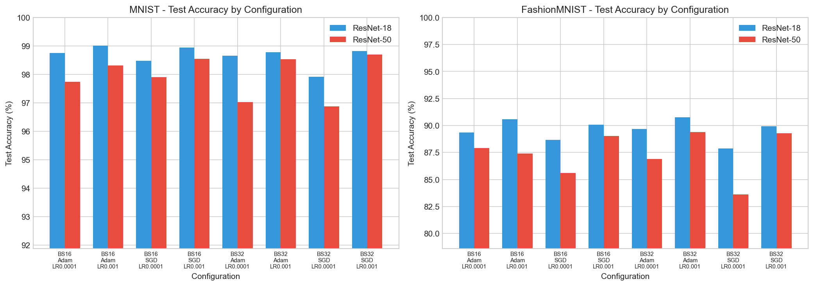
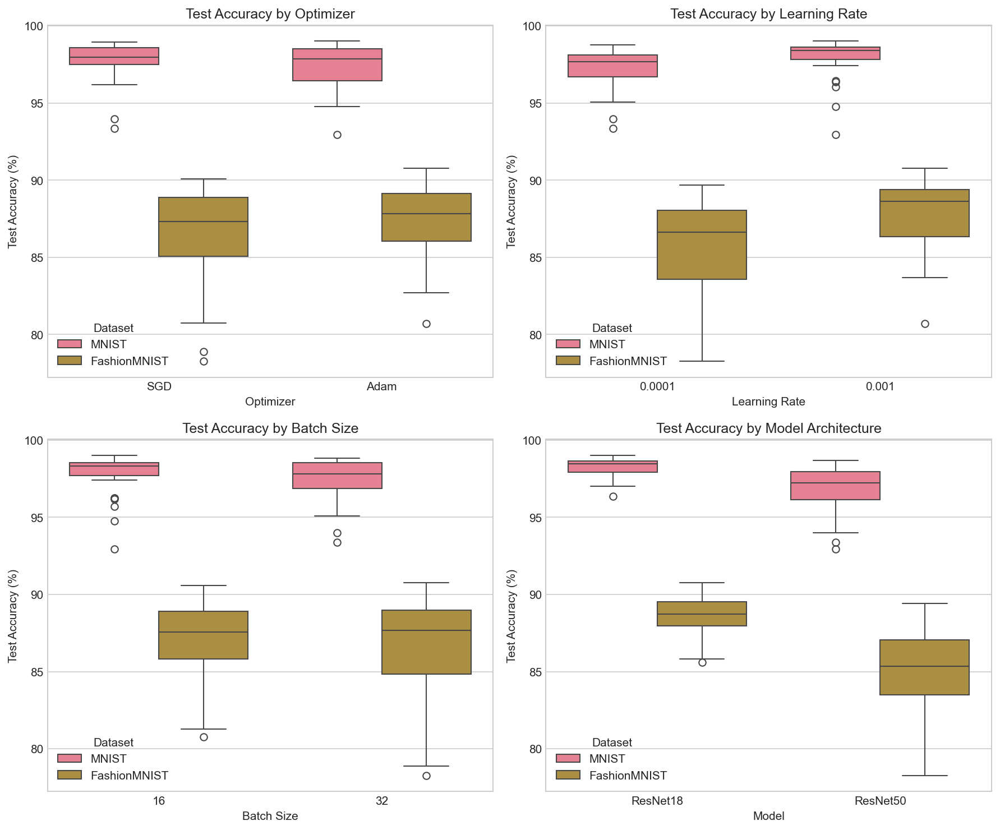
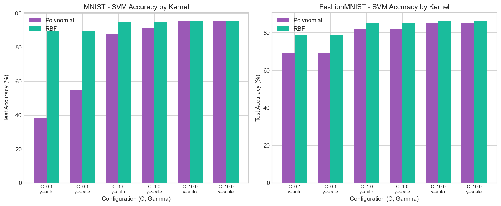
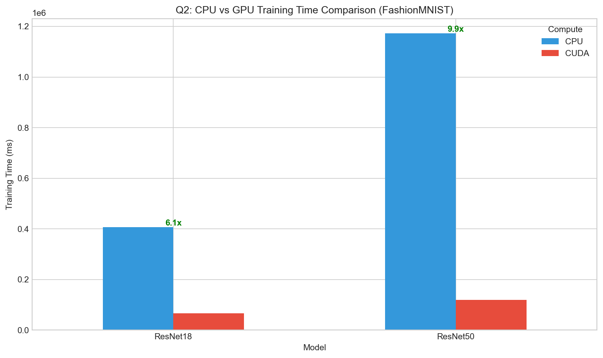
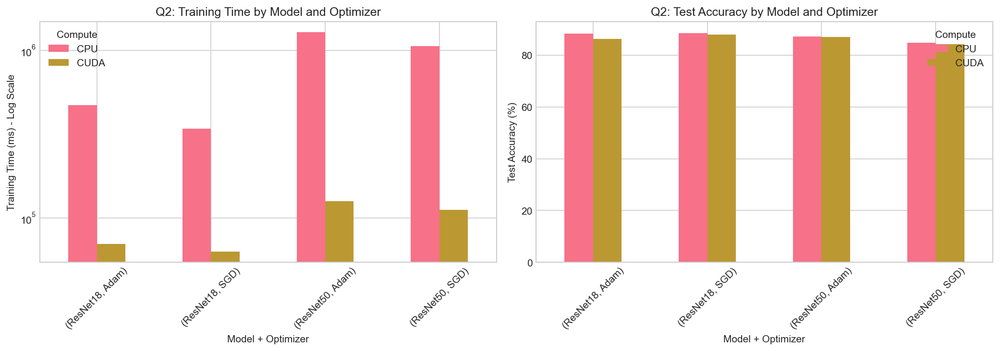

# MLOps Assignment 1: Deep Learning Experiments

[](https://duckquack123.github.io/MLOps-Vasishth-M25CSA007/)

**Author:** Vasishth  
**Roll Number:** M25CSA007  
**Branch:** Assignment-1

---

## 📋 Overview

This repository contains experiments comparing deep learning models (ResNet-18, ResNet-50) and SVM classifiers on MNIST and FashionMNIST datasets. The experiments analyze the impact of various hyperparameters on model performance and training efficiency.

## 📁 Repository Structure

```
MLOps-Vasishth-M25CSA007/
├── m25csa007-mldlops-assignment-1.ipynb  # Main experiment notebook
├── models/                                # Best trained model weights (.pth)
├── plots/                                 # Visualization graphs
├── data/                                  # MNIST & FashionMNIST datasets
├── *.csv                                  # Results files
├── Rollnumber_Name_Ass1.pdf              # Assignment report
└── README.md                              # This file
```

---

## 🔬 Experiment Details

### Datasets
| Dataset | Description | Classes | Train | Validation | Test |
|---------|-------------|---------|-------|------------|------|
| MNIST | Handwritten digits | 10 | 42,000 | 6,000 | 12,000 |
| FashionMNIST | Fashion items | 10 | 42,000 | 6,000 | 12,000 |

**Data Split:** 70% Train - 10% Validation - 20% Test

### Models
- **ResNet-18** (11.18M parameters, 33.18M FLOPs)
- **ResNet-50** (23.52M parameters, 78.76M FLOPs)
- **SVM** (Polynomial and RBF kernels)

### Training Configuration
- Mixed Precision Training (AMP): Enabled
- Pin Memory: True/False variations
- Epochs: 5

---

## 📊 Q1(a): ResNet Classification Results

### MNIST Dataset - Test Classification Accuracy (%)

| Batch Size | Optimizer | Learning Rate | ResNet-18 | ResNet-50 |
|:----------:|:---------:|:-------------:|:---------:|:---------:|
| 16 | SGD | 0.001 | 98.95 | 98.55 |
| 16 | SGD | 0.0001 | 98.48 | 97.91 |
| 16 | Adam | 0.001 | **99.01** | 98.31 |
| 16 | Adam | 0.0001 | 98.76 | 97.74 |
| 32 | SGD | 0.001 | 98.82 | **98.70** |
| 32 | SGD | 0.0001 | 97.91 | 96.87 |
| 32 | Adam | 0.001 | 98.78 | 98.54 |
| 32 | Adam | 0.0001 | 98.66 | 97.02 |

🏆 **Best MNIST Result:** 99.01% (ResNet-18, Adam, lr=0.001, bs=16)

### FashionMNIST Dataset - Test Classification Accuracy (%)

| Batch Size | Optimizer | Learning Rate | ResNet-18 | ResNet-50 |
|:----------:|:---------:|:-------------:|:---------:|:---------:|
| 16 | SGD | 0.001 | 90.06 | 89.02 |
| 16 | SGD | 0.0001 | 88.66 | 85.60 |
| 16 | Adam | 0.001 | 90.57 | 87.42 |
| 16 | Adam | 0.0001 | 89.35 | 87.91 |
| 32 | SGD | 0.001 | 89.93 | 89.29 |
| 32 | SGD | 0.0001 | 87.86 | 83.60 |
| 32 | Adam | 0.001 | **90.76** | **89.40** |
| 32 | Adam | 0.0001 | 89.69 | 86.91 |

🏆 **Best FashionMNIST Result:** 90.76% (ResNet-18, Adam, lr=0.001, bs=32)

### Accuracy Comparison Visualization



### Hyperparameter Analysis



---

## 📊 Q1(b): SVM Classification Results

### MNIST Dataset - SVM Results

| Kernel | C | Gamma | Test Accuracy (%) | Training Time (ms) |
|:------:|:-:|:-----:|:-----------------:|:------------------:|
| poly | 0.1 | scale | 54.75 | 39,593 |
| poly | 1.0 | scale | 91.50 | 22,815 |
| poly | 10.0 | scale | **95.50** | 16,030 |
| rbf | 0.1 | scale | 89.35 | 20,014 |
| rbf | 1.0 | scale | 94.85 | 11,362 |
| rbf | 10.0 | scale | **95.60** | 10,730 |

🏆 **Best MNIST SVM:** 95.60% (RBF, C=10.0, gamma=scale)

### FashionMNIST Dataset - SVM Results

| Kernel | C | Gamma | Test Accuracy (%) | Training Time (ms) |
|:------:|:-:|:-----:|:-----------------:|:------------------:|
| poly | 0.1 | scale | 69.05 | 21,222 |
| poly | 1.0 | scale | 82.15 | 11,343 |
| poly | 10.0 | scale | 85.15 | 9,358 |
| rbf | 0.1 | scale | 78.65 | 14,453 |
| rbf | 1.0 | scale | 85.00 | 9,353 |
| rbf | 10.0 | scale | **86.30** | 9,091 |

🏆 **Best FashionMNIST SVM:** 86.30% (RBF, C=10.0, gamma=scale)

### SVM Accuracy Visualization



---

## 📊 Q2: CPU vs GPU Performance Comparison

### Training on FashionMNIST (Batch Size=32, lr=0.001, 2 epochs)

| Compute | Model | Optimizer | Test Accuracy (%) | Training Time (ms) | FLOPs |
|:-------:|:-----:|:---------:|:-----------------:|:------------------:|:-----:|
| CPU | ResNet-18 | SGD | 88.54 | 341,621 | 33.18M |
| CPU | ResNet-18 | Adam | 88.23 | 470,803 | 33.18M |
| CPU | ResNet-50 | SGD | 84.84 | 1,064,108 | 78.76M |
| CPU | ResNet-50 | Adam | 87.11 | 1,281,028 | 78.76M |
| **CUDA** | ResNet-18 | SGD | 87.97 | **62,967** | 33.18M |
| **CUDA** | ResNet-18 | Adam | 86.14 | **69,794** | 33.18M |
| **CUDA** | ResNet-50 | SGD | 84.18 | **111,651** | 78.76M |
| **CUDA** | ResNet-50 | Adam | 86.96 | **125,693** | 78.76M |

### GPU Speedup Analysis

| Model | CPU Time (ms) | GPU Time (ms) | Speedup |
|:-----:|:-------------:|:-------------:|:-------:|
| ResNet-18 (SGD) | 341,621 | 62,967 | **5.4x** |
| ResNet-18 (Adam) | 470,803 | 69,794 | **6.7x** |
| ResNet-50 (SGD) | 1,064,108 | 111,651 | **9.5x** |
| ResNet-50 (Adam) | 1,281,028 | 125,693 | **10.2x** |

### CPU vs GPU Visualization





---

## 🏆 Best Models Summary

| Task | Dataset | Model | Configuration | Accuracy |
|:----:|:-------:|:-----:|:-------------:|:--------:|
| Q1(a) | MNIST | ResNet-18 | Adam, lr=0.001, bs=16 | **99.01%** |
| Q1(a) | FashionMNIST | ResNet-18 | Adam, lr=0.001, bs=32 | **90.76%** |
| Q1(b) | MNIST | SVM (RBF) | C=10.0, gamma=scale | **95.60%** |
| Q1(b) | FashionMNIST | SVM (RBF) | C=10.0, gamma=scale | **86.30%** |

### Best Model Files (in `models/` folder)
- `MNIST_ResNet18_bs16_Adam_lr0.001_pinFalse_ep5.pth` - Best MNIST model
- `FashionMNIST_ResNet18_bs32_Adam_lr0.001_pinFalse_ep5.pth` - Best FashionMNIST model

---

## 📈 Key Findings

### 1. Model Architecture
- **ResNet-18 consistently outperforms ResNet-50** on both datasets
- Smaller models generalize better on relatively simple datasets like MNIST/FashionMNIST
- ResNet-50's additional capacity leads to overfitting

### 2. Optimizer Comparison
- **Adam optimizer** achieves higher accuracy than SGD in most configurations
- Adam converges faster and is less sensitive to learning rate choices
- SGD with momentum can match Adam with proper tuning

### 3. Learning Rate Impact
- **lr=0.001** generally produces better results than lr=0.0001
- Higher learning rate enables faster convergence in limited epochs
- Lower learning rate may need more epochs to achieve comparable results

### 4. Batch Size Effect
- **Batch size 16** slightly better for ResNet-18 on MNIST
- **Batch size 32** better for FashionMNIST with Adam optimizer
- Smaller batches provide more regularization effect

### 5. CPU vs GPU Performance
- GPU provides **5-10x speedup** over CPU
- Speedup is more significant for larger models (ResNet-50)
- Mixed precision training (AMP) provides additional GPU acceleration

### 6. Deep Learning vs SVM
- Deep learning (ResNet) significantly outperforms SVM on both datasets
- MNIST: 99.01% (ResNet) vs 95.60% (SVM)
- FashionMNIST: 90.76% (ResNet) vs 86.30% (SVM)

---

## 🛠️ How to Run

### Prerequisites
```bash
pip install torch torchvision matplotlib seaborn pandas scikit-learn tqdm thop
```

### Run Experiments
```bash
# Open and run the Jupyter notebook
jupyter notebook m25csa007-mldlops-assignment-1.ipynb
```

### Generate Plots
```bash
python generate_plots.py
```

---

## 📂 Files Description

| File | Description |
|------|-------------|
| `m25csa007-mldlops-assignment-1.ipynb` | Main experiment notebook |
| `grid_search_results_q1a.csv` | Full Q1(a) grid search results |
| `q1a_MNIST_results.csv` | MNIST best results summary |
| `q1a_FashionMNIST_results.csv` | FashionMNIST best results summary |
| `svm_results_q1b.csv` | Q1(b) SVM results |
| `cpu_gpu_comparison_q2.csv` | Q2 CPU vs GPU comparison |
| `M25CSA007_BhattVasishth_Ass1.pdf` | Assignment report |
| `generate_plots.py` | Script to generate all visualizations |

---

## 📄 Report

The detailed report with analysis is available in: [`M25CSA007_BhattVasishth_Ass1.pdf`](M25CSA007_BhattVasishth_Ass1.pdf)

---

## 📧 Contact

- **Name:** Vasishth
- **Roll Number:** M25CSA007
- **Repository:** [MLOps-Vasishth-M25CSA007](https://github.com/duckquack123/MLOps-Vasishth-M25CSA007)

---

*Last Updated: January 2026*
